# WanNianLi_Full-
邮件提醒功能
# 万年历小程序功能PRD文档（提升用户粘性版）

# 一、文档基础信息

|项目名称|万年历小程序（粘性优化版）|文档版本|V1.0|
|---|---|---|---|
|撰写人|-|撰写日期|-|
|产品目标|以“高频刚需+互动留存+社交裂变”为核心，优化现有万年历功能，提升用户日活、留存率及分享率，降低用户卸载率，打造“实用+有记忆点”的万年历工具|||
|核心受众|全年龄段用户，重点覆盖20-55岁，有日历查询、日程管理、节日/纪念日提醒、黄历参考、日常打卡需求的用户|||
|开发优先级|P0（必须实现）：核心日历+天气+日程提醒；P1（优先实现）：签到积分+小组件+分享图；P2（迭代实现）：打卡+共享日历+特色小工具；P3（优化实现）：深度黄历+运势内容|||
# 二、产品核心定位

不止是“查日历”，更是「日常刚需工具+情感陪伴载体+轻社交入口」，以极简操作、高频使用场景为基础，通过互动和个性化功能，让用户形成“每日打开”的习惯，实现“用完不删、高频复用、主动分享”的粘性目标。

# 三、核心功能模块详细说明（按优先级排序）

## 模块一：核心日历模块（P0，刚需基础）

### 3.1.1 基础日历展示

- 功能描述：默认展示当日公历、农历日期，支持公历/农历切换，可左右滑动切换月份、年份（支持快速跳转至指定年/月），突出显示当日日期（差异化样式，如加粗、底色标注）。

- 核心需求：满足用户“查日期、切换日期”的基础需求，操作便捷，视觉清晰。

- 交互细节：滑动切换月份时，有平滑过渡动画；点击年份/月份，弹出快速选择器（年份支持近50年选择，月份支持1-12月选择）；当日日期点击无额外操作，非当日日期点击，跳转至对应日期详情。

- 补充说明：标注当月节气、法定节假日（放假日期标红，调休上班日期标灰并标注“调休”），节假日旁显示放假天数（如“国庆·7天”）。

### 3.1.2 黄历查询（基础版）

- 功能描述：默认展示当日黄历核心内容，包括宜、忌、时辰吉凶、胎神方位、冲煞信息，支持点击“更多黄历”查看完整内容（P3迭代，含值日、星宿、彭祖百忌等）。

- 核心需求：满足部分用户对黄历的基础参考需求，不搞迷信化表述，主打“参考性”。

- 交互细节：宜、忌分栏展示（宜为绿色，忌为红色），清晰区分；时辰吉凶按时间段排序，标注“吉”“凶”“平”，点击时辰可查看详细说明；“更多黄历”入口置于黄历模块底部，点击跳转至独立黄历页面。

### 3.1.3 天气联动

- 功能描述：在当日日历顶部，同步展示当前城市当日天气（温度、天气状态，如晴、雨）、未来7天天气预览，附带穿衣、出行、洗车、晾晒4类核心指数（简洁图标+文字提示）。

- 核心需求：结合日历高频场景，新增天气刚需功能，减少用户切换小程序的成本，提升使用频次。

- 交互细节：支持手动切换城市（点击城市名称，弹出城市选择器）；天气图标点击，跳转至天气详情页（展示完整7天天气、小时级天气）；指数提示 hover 时，显示简短说明（如穿衣指数“适宜穿薄外套，早晚温差大”）。

- 补充说明：自动获取用户当前城市（需申请微信地理位置权限，用户拒绝后，默认显示热门城市，允许手动切换）。

## 模块二：日程提醒模块（P0，核心留存）

### 3.2.1 日程/待办添加与管理

- 功能描述：支持用户添加日程、待办事项，可设置标题、时间（精确到小时/分钟）、重复规则（单次、每日、每周、每月、每年）、提醒时间（提前5分钟、10分钟、30分钟、1小时、1天），支持编辑、删除、完成标记。

- 核心需求：将日历与日程绑定，让用户“查日历”的同时，能“管日程”，形成高频使用闭环。

- 交互细节：添加入口置于日历页面右下角（悬浮按钮，图标为“+”，点击弹出“添加日程”“添加待办”选项）；日程/待办按时间排序，展示在对应日期下方，未完成待办标红，已完成待办划横线、标灰；点击日程/待办，可查看详情、编辑或删除；支持批量删除未完成/已完成待办。

- 补充说明：支持微信云同步（用户登录后，日程/待办自动同步至云端，切换设备可同步查看），无需手动备份。

### 3.2.2 多场景提醒

- 功能描述：除常规日程提醒外，新增特色提醒场景，包括生日提醒、纪念日提醒、还款提醒、打卡提醒，支持自定义提醒文案。

- 核心需求：覆盖用户高频提醒场景，提升功能实用性，让用户依赖小程序的提醒功能，增加打开频次。

- 交互细节：添加提醒时，可选择提醒场景（下拉选择），选择场景后，自动匹配对应模板（如生日提醒，默认文案“今日是XX的生日，记得送上祝福哦”）；提醒触发时，支持推送微信服务通知、短信提醒、邮件提醒（三种方式可勾选设置，默认勾选微信提醒），点击通知/短信/邮件链接跳转至对应日程/提醒页面；支持设置“重复提醒”（如生日每年提醒，还款每月提醒）。

### 3.2.3 纪念日/生日管家

- 功能描述：支持用户添加亲友生日、重要纪念日（如恋爱纪念日、结婚纪念日、入职纪念日），自动计算倒计时，提醒时附带祝福文案模板（可直接复制发送），支持标注亲友关系、生日农历/公历。

- 核心需求：解决用户“忘记重要日子”的痛点，结合情感需求，提升用户粘性（高频查看倒计时、接收提醒）。

- 交互细节：新增“纪念日/生日”独立入口（置于底部导航栏），可按“近期提醒”“全部列表”排序；点击纪念日/生日，可编辑信息、查看倒计时、选择祝福文案；支持批量添加亲友信息，支持导入手机通讯录生日（需申请通讯录权限）。

## 模块三：互动留存模块（P1，提升日活）

### 3.3.1 每日签到+积分体系

- 功能描述：用户每日打开小程序，可进行签到，连续签到可获得额外积分（1天1积分，连续7天额外+3积分，连续30天额外+10积分）；积分可用于兑换福利（简约日历壁纸、头像框、无广告特权、祝福文案合集）。

- 核心需求：通过“签到激励”，引导用户每日打开小程序，培养使用习惯，提升日活和留存率。

- 交互细节：签到入口置于日历首页顶部（显眼位置，显示“今日可签到”“连续签到X天”），点击签到后，弹出签到成功动画+积分到账提示；新增“积分商城”入口，展示可兑换福利及所需积分，点击可直接兑换；积分明细可查（显示积分获取、消耗记录）；连续签到中断后，重新开始计数。

- 补充说明：福利定期更新（每月更新1-2款壁纸、头像框），保持用户兑换兴趣；无广告特权兑换后，有效期为7天/30天，提升用户复购（积分兑换）意愿。

### 3.3.2 个性化桌面小组件

- 功能描述：支持添加3类桌面小组件（日历小组件、天气小组件、倒计时小组件），每种小组件提供3种风格（简约风、国风、可爱风），支持自定义小组件大小（小、中、大），点击小组件直接跳转至小程序对应页面。

- 核心需求：将小程序“延伸至桌面”，让用户无需打开小程序，也能看到核心信息（日期、天气、倒计时），触发用户主动打开小程序，提升打开频次。

- 交互细节：新增“小组件”入口（置于个人中心），展示所有小组件样式，点击“添加到桌面”，弹出引导教程（适配微信桌面小组件添加流程）；支持编辑小组件内容（如倒计时小组件，可选择对应纪念日/日程）；小组件数据与小程序实时同步（如日期更新、天气更新、倒计时变化）。

- 补充说明：适配微信小程序桌面小组件规范，支持iOS、Android双端，针对不同手机型号，优化小组件显示效果，避免变形。

### 3.3.3 每日轻内容（情绪价值）

- 功能描述：在日历首页底部，新增“每日一言”“每日运势”两个轻内容模块（可切换查看）；每日一言为励志、治愈、温暖类短句（无广告）；每日运势为生肖日运（简约版，不搞迷信，主打娱乐性、情绪陪伴）。

- 核心需求：通过轻内容，增加用户打开小程序的“额外动力”，提升使用体验，打造情感记忆点。

- 交互细节：每日0点自动更新内容；点击“每日一言”，可复制文案、分享至微信好友/朋友圈；点击“每日运势”，可选择自己的生肖，查看详细日运（事业、财运、情绪，简约文字，无复杂解读）；支持“换一句”“换一次运势”（每日可换3次）。

### 3.3.4 日常打卡功能

- 功能描述：支持用户创建打卡任务（如早睡、减肥、学习、喝水、运动、阅读），设置打卡周期（1天、7天、30天）、打卡时间，每日打卡后，生成打卡记录，支持查看打卡日历、打卡统计（完成率、连续打卡天数）。

- 核心需求：结合用户“自我提升”的需求，通过打卡功能，引导用户每日打开小程序，形成长期使用习惯，提升留存率。

- 交互细节：新增“打卡”入口（置于底部导航栏），可创建自定义打卡任务，也可选择模板打卡任务；每日打卡入口显眼，打卡成功后，弹出动画+打卡提示，更新打卡统计；支持分享打卡记录（如“连续打卡7天，继续加油”）；打卡完成率达到100%，可获得额外积分奖励（与签到积分通用）。

## 模块四：社交裂变模块（P1，提升分享率）

### 3.4.1 一键生成分享图

- 功能描述：支持生成4类分享图（今日黄历图、今日天气图、心情卡片、倒计时卡片），分享图可自定义文字（如心情卡片可输入自己的心情）、选择模板风格（简约、国风、可爱），支持保存至手机相册、一键分享至微信好友/朋友圈。

- 核心需求：通过“分享图”，让用户主动分享小程序内容，实现社交裂变，同时提升用户使用频次（生成分享图需打开小程序）。

- 交互细节：分享图入口置于对应模块底部（如黄历模块底部“生成黄历分享图”，倒计时页面“生成倒计时分享图”）；生成分享图时，可预览效果，支持修改文字、切换模板；分享图底部默认添加小程序入口（引导好友点击进入小程序）；生成速度控制在1秒内，避免用户等待。

### 3.4.2 共享日历

- 功能描述：支持用户创建共享日历（如家庭日历、情侣日历、团队日历），邀请微信好友加入，共享日历内的日程、待办、提醒，所有成员可查看、编辑、添加日程（可设置编辑权限：仅创建者可编辑/所有成员可编辑）。

- 核心需求：解决“多人协同日程管理”的痛点，通过“共享”功能，提升用户粘性（多人使用、互相触发打开），同时实现社交裂变。

- 交互细节：新增“共享日历”入口（置于日程模块），可创建共享日历、设置日历名称、邀请好友；邀请好友支持微信转发邀请链接，好友点击即可加入；共享日历内的日程，标注添加人姓名；可随时移除成员、修改编辑权限、删除共享日历；成员操作日程时，其他成员可收到提醒（支持微信服务通知、短信提醒、邮件提醒，由成员自行设置偏好），如“XX在家庭日历中添加了XX日程”。

### 3.4.3 节日祝福模板

- 功能描述：按节日分类（春节、端午、中秋、国庆、生日、情人节等），提供丰富的祝福文案模板（分为简短版、正式版、可爱版、古风版），支持复制文案、一键发送至微信好友/朋友圈，可自定义文案中的称呼、内容。

- 核心需求：结合日历的“节日场景”，为用户提供便捷的祝福文案工具，提升用户使用体验，同时触发分享行为。

- 交互细节：新增“祝福模板”入口（置于底部导航栏，或节日当天在首页弹窗提示）；按节日分类展示模板，支持搜索（如搜索“生日”，显示所有生日祝福模板）；点击模板，可复制、编辑、分享；节日前3天，在首页推送对应节日的祝福模板入口，引导用户使用。

## 模块五：特色优化模块（P2/P3，差异化竞争）

### 3.5.1 深度黄历功能（P3）

- 功能描述：在基础黄历之上，新增值日、星宿、彭祖百忌、吉神方位、凶神方位、纳音、干支等深度内容，支持按日期查询历史黄历，提供黄历术语解释（如“胎神”“冲煞”的含义）。

- 核心需求：满足部分用户对黄历的深度参考需求，打造差异化优势，提升用户留存（针对黄历需求明确的用户）。

- 交互细节：深度黄历置于“更多黄历”页面，按类别分栏展示，清晰有序；黄历术语 hover 时，弹出简短解释；历史黄历支持快速跳转至指定日期查询。

### 3.5.2 星座运势内容（P3）

- 功能描述：新增星座运势模块，支持用户选择自己的星座，查看日运、周运、月运（简约版，主打娱乐性、情绪陪伴），内容包括事业、财运、情绪、感情等，支持分享运势内容。

- 核心需求：丰富轻内容模块，覆盖更多用户兴趣点，提升用户打开频次（针对星座兴趣用户）。

- 交互细节：星座运势入口置于“每日运势”模块，可切换“生肖运势”“星座运势”；选择星座后，默认展示日运，可切换周运、月运；支持“换一次运势”（每日可换3次），支持复制、分享运势内容。

### 3.5.3 实用小工具合集（P2）

- 功能描述：新增实用小工具合集，包括计算器、单位换算（长度、重量、面积、时间等）、二维码生成/识别、尺子、分贝仪，工具均为轻量版，无需跳转，在小程序内即可使用。

- 核心需求：丰富小程序功能维度，让用户在“查日历、管日程”的同时，能使用常用小工具，减少用户切换小程序的成本，提升粘性。

- 交互细节：新增“小工具”入口（置于底部导航栏），工具按类别排序，点击工具即可进入使用；工具操作简洁，无需复杂步骤（如计算器，直接显示数字键盘，支持基础运算）；工具使用后，保留上次使用记录，方便用户再次使用。

### 3.5.4 历史上的今天（P2）

- 功能描述：在日历首页底部，新增“历史上的今天”模块，展示当日历史上发生的3-5件简短有趣的事件（不冗长，每件事件1-2句话），每日0点自动更新。

- 核心需求：增加小程序的趣味性，提升用户打开小程序的“额外动力”，打造记忆点，提升留存率。

- 交互细节：点击“历史上的今天”模块，可查看更多事件；支持分享单个事件至微信好友/朋友圈；事件内容以“有趣、有意义”为主，避免负面、冗长内容。

# 四、交互设计核心要求

1. 极简操作：所有核心功能（查日历、添加日程、签到、生成分享图）操作步骤不超过3步，避免复杂流程，降低用户使用门槛。

2. 视觉统一：整体风格简洁、清爽，颜色以浅色系为主（如白色、浅灰色、淡绿色），重点内容（当日日期、提醒、签到入口）突出显示，避免杂乱；字体统一，大小适中，适配不同年龄段用户阅读。

3. 反馈及时：所有操作（签到、添加日程、生成分享图、打卡）均有明确反馈（动画、文字提示），让用户知道操作已成功；加载速度控制在1秒内，避免用户等待。

4. 权限友好：申请微信权限（地理位置、通讯录、服务通知）时，明确告知用户“申请权限的用途”；短信提醒需获取用户手机号（自愿绑定），邮件提醒需用户填写邮箱（自愿绑定）；用户拒绝权限或不绑定手机号、邮箱后，不强制弹窗，仍可正常使用核心功能（仅限制对应提醒方式）。

5. 导航清晰：底部导航栏固定，包含“首页（日历）、日程、打卡、祝福模板、我的”5个核心入口，用户可快速切换模块；各页面均有“返回”按钮，方便用户返回上一级页面。

# 五、用户留存&amp;促活策略

1. 签到激励：连续签到可获得额外积分，积分可兑换福利，定期更新兑换福利，提升用户签到积极性；连续签到30天，可获得“终身无广告”特权（可选）。

2. 提醒触达：用户设置的日程、提醒，支持通过微信服务通知、短信、邮件三种方式推送（用户可自行设置默认提醒方式或多方式叠加），引导用户打开小程序；节日前3天，推送节日祝福模板、节日倒计时提醒；用户连续3天未打开小程序，推送“签到提醒+积分福利”通知（优先按用户设置的提醒方式推送），唤醒沉睡用户。

3. 内容更新：每日一言、每日运势、历史上的今天，每日0点自动更新；节日祝福模板，提前1周更新对应节日的文案，引导用户使用、分享。

4. 社交裂变：用户生成的分享图、共享日历邀请、运势内容，分享后，好友点击进入小程序，分享者可获得额外积分奖励（每日最多可获得5积分），提升分享意愿。

5. 个性化推荐：根据用户使用习惯（如常用黄历、常用打卡类型、常用祝福模板），个性化推荐对应内容，提升用户使用体验。

# 六、开发约束&注意事项

1. 合规性：黄历、运势内容，需标注“仅供参考，不构成迷信引导”，避免涉及封建迷信表述；祝福模板、历史事件内容，需符合国家法律法规，避免负面、敏感内容。

2. 兼容性：适配微信小程序最新版本，支持iOS、Android双端，针对不同手机型号（尤其是大屏手机、老年机），优化页面显示和操作体验，避免页面变形、操作失灵。

3. 性能优化：控制小程序体积（不超过2MB），优化加载速度，避免卡顿；图片、动画资源压缩处理，减少加载时间；云同步功能，确保数据安全、同步及时，避免数据丢失。

4. 权限控制：严格按照微信小程序权限规范，申请所需权限，不申请无关权限；短信提醒需用户自愿绑定手机号，邮件提醒需用户自愿填写邮箱，不强制收集；用户拒绝权限、不绑定手机号或邮箱后，不影响核心功能使用，仅限制对应提醒方式。

5. 迭代规划：优先开发P0、P1级功能，上线后，根据用户反馈（使用数据、评论），迭代优化功能，新增P2、P3级功能；每季度迭代1次，每次迭代重点解决用户痛点，优化使用体验。

# 七、验收标准

1. 核心功能：P0、P1级功能全部实现，操作流畅，无卡顿、无bug；P2、P3级功能，按迭代计划逐步实现，上线前完成测试。

2. 交互体验：操作步骤符合“不超过3步”要求，反馈及时，视觉统一，导航清晰；权限申请友好，无强制弹窗。

3. 性能要求：小程序加载速度≤1秒，操作响应速度≤0.5秒；云同步功能正常，数据无丢失、同步及时；分享图生成速度≤1秒。

4. 兼容性：在iOS、Android不同手机型号上，页面显示正常，操作无失灵；微信小程序最新版本适配正常。

5. 合规性：所有内容符合国家法律法规，无封建迷信、负面、敏感内容；权限申请符合微信小程序规范。

# 八、后续迭代建议

1. 新增“老年模式”：字体放大、颜色加深，简化页面布局，保留核心功能（日历、提醒、黄历），适配老年用户使用习惯。

2. 新增“自定义皮肤”：支持用户自定义小程序皮肤颜色、背景图，提升个性化体验。

3. 新增“日历打印”功能：支持用户将指定月份的日历、日程，生成打印版，保存至手机相册，方便打印。

4. 对接第三方服务：对接外卖、电影票、机票预订等服务，结合日历场景，提供一站式服务，提升用户粘性。

5. 用户社区：新增用户社区模块，用户可分享打卡记录、祝福文案、黄历心得，提升用户互动性，打造用户粘性闭环。

# 九、简易功能架构图

说明：架构图按“核心层-功能层-细分功能”层级划分，标注各模块开发优先级（P0/P1/P2/P3），清晰呈现功能关联，适配开发落地需求。

```mermaid

graph TD
    A[万年历小程序（核心层）] --> B[核心日历模块（P0）]
    A --> C[日程提醒模块（P0）]
    A --> D[互动留存模块（P1）]
    A --> E[社交裂变模块（P1）]
    A --> F[特色优化模块（P2/P3）]
    A --> G[基础支撑（P0）]
    
    B --> B1[基础日历展示- 公历/农历切换、日期跳转- 节假日/节气标注]
    B --> B2[黄历查询（基础版）- 宜/忌、时辰吉凶等核心内容]
    B --> B3[天气联动- 当日/7天天气、生活指数- 城市切换]
    
    C --> C1[日程/待办管理- 添加/编辑/删除/同步- 重复规则设置]
    C --> C2[多场景提醒- 微信/短信/邮件三种提醒- 生日/纪念日/还款等场景]
    C --> C3[纪念日/生日管家- 倒计时、祝福模板- 亲友信息管理]
    
    D --> D1[每日签到+积分体系- 连续签到激励、积分兑换]
    D --> D2[个性化桌面小组件- 日历/天气/倒计时组件- 多风格可选]
    D --> D3[每日轻内容- 每日一言、生肖日运- 内容更新/分享]
    D --> D4[日常打卡- 自定义/模板打卡任务- 打卡统计、积分奖励]
    
    E --> E1[一键生成分享图- 黄历/天气/倒计时等卡片- 模板自定义、保存分享]
    E --> E2[共享日历- 家庭/团队日历创建- 成员管理、权限设置]
    E --> E3[节日祝福模板- 多节日、多风格文案- 复制/一键分享]
    
    F --> F1[特色小工具合集（P2）- 计算器、单位换算等- 轻量便捷使用]
    F --> F2[历史上的今天（P2）- 每日趣味历史事件- 分享功能]
    F --> F3[深度黄历（P3）- 值日、星宿等深度内容- 历史黄历查询]
    F --> F4[星座运势（P3）- 日/周/月运查询- 内容分享]
    
    G --> G1[微信权限适配- 地理位置、通讯录等- 自愿授权、友好提示]
    G --> G2[云同步- 日程/待办云端备份- 多设备同步]
    G --> G3[消息推送- 提醒通知、唤醒通知- 按用户偏好推送]
    
```

> （注：文档部分内容可能由 AI 生成）

